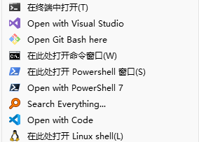

# 主题：文件管理器右键菜单增加从命令提示符打开

**Revision:** 1.0  
**最后更新:** 2025/05/06

## 1. 需求

在使用某些命令行工具时，从文件管理器右键菜单中访问 `Open command window here` 使用起来会较为方便。

可按后续章节，分别导入对应的注册表。
- **管理员**：通常在 `HKEY_CLASSES_ROOT\Directory\Background\shell` 下新增子项目。
- **普通用户**：通常在 `HKEY_CURRENT_USER\Software\Classes\Directory\Background\shell` 下新增子项目。

## 2. 从 命令提示符(CMD) 打开

命令行提示符(CMD) 默认路径：
- C:\Windows\System32\cmd.exe

将如下 `.reg` 文件另存后导入注册表：
- **管理员**：[OpenCmdHere_ROOT.reg](reg/OpenCmdHere_ROOT.reg)
- **普通用户**：[OpenCmdHere_HKCU.reg](reg/OpenCmdHere_HKCU.reg)

然后在文件管理器打开某个文件夹，空白处右击，右键菜单中选择 `Open command window here` 将打开一个新的 "命令提示符(CMD)" 窗口。

## 3. 从 Windows PowerShell 打开

Windows PowerShell (系统自带) 默认路径：
- C:\Windows\System32\WindowsPowerShell\v1.0\powershell.exe

默认会有一个需要按住Shift键后右击鼠标能显示的上下文菜单项（不带图标）。  
如需创建一个通常情况下的右键菜单（无需按Shift键，带图标），可将如下 `.reg` 文件另存后导入注册表：
将如下 `.reg` 文件另存后导入注册表：
- **管理员**：[OpenPowerShell_ROOT.reg](reg/OpenPowerShell_ROOT.reg)
- **普通用户**：[OpenPowerShell_HKCU.reg](reg/OpenPowerShell_HKCU.reg)

然后在文件管理器打开某个文件夹，空白处右击，右键菜单中选择 `Open PowerShell window here` 将打开一个新的 "Windows PowerShell" 窗口。

## 4. 从 PowerShell 7 打开

PowerShell 7 默认安装路径：
- C:\Program Files\PowerShell\7\pwsh.exe

将如下 `.reg` 文件另存后导入注册表：
- **管理员**：[OpenPwsh7_ROOT.reg](reg/OpenPwsh7_ROOT.reg)

普通用户可使用 zip 版 PowerShell 7，假设解压到如下目录：
- C:\Tools\PowerShell\7\pwsh.exe

将如下 `.reg` 文件另存后导入注册表，注意按实际路径修改（使用双斜杠）：
- **普通用户**：[OpenPwsh7_HKCU.reg](reg/OpenPwsh7_HKCU.reg)

然后在文件管理器打开某个文件夹，空白处右击，右键菜单中选择 `Open with PowerShell 7` 将打开一个新的 "PowerShell 7" 窗口。

## 5. 从 Git Bash 打开

Git Bash 默认安装路径：
- C:\Program Files\Git\git-bash.exe

默认安装程序会自动添加右键菜单，如没有找到，可将如下 `.reg` 文件另存后导入注册表：
- **管理员**：[OpenGitBash_ROOT.reg](reg/OpenGitBash_ROOT.reg)

普通用户可使用 PortableGit，假设解压到如下目录：
- C:\Tools\PortableGit\git-bash.exe

将如下 `.reg` 文件另存后导入注册表，注意按实际路径修改（使用双斜杠）：
- **普通用户**：[OpenGitBash_HKCU.reg](reg/OpenGitBash_HKCU.reg)

然后在文件管理器打开某个文件夹，空白处右击，右键菜单中选择 `Open Git Bash here` 将打开一个新的 "Git Bash" 窗口。

## 6. 从 WSL shell 打开

WSL 默认安装路径：
- C:\Program Files\WSL\wsl.exe

WSL2以后，默认会有一个需要按住Shift键后右击鼠标能显示的上下文菜单项（不带图标）。  
如需创建一个通常情况下的右键菜单（无需按Shift键，带图标），可将如下 `.reg` 文件另存后导入注册表：
- **管理员**：[OpenWSL_ROOT.reg](reg/OpenWSL_ROOT.reg)

然后在文件管理器打开某个文件夹，空白处右击，右键菜单中选择 `Open Linux shell here` 将打开一个新的 "WSL shell" 窗口。

## 7. 便携版 VSCode 增加右键菜单

便携版 VSCode 安装路径：

- C:\Program Files\WSL\wsl.exe

（完）
