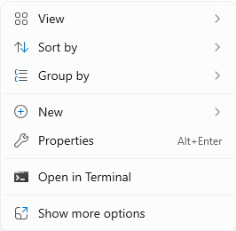
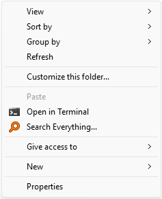

# 主题：Windows 11 文件管理器右键菜单恢复传统风格

**Revision:** 1.0  
**最后更新:** 2025/05/06

## 1. 需求

Windows 11 文件管理器默认使用新的风格。



传统风格的右键菜单，需要二次点击 [Show more options] 后才能显示，在使用某些第三方应用（如 7-Zip、Beyond Compare）的右键菜单时很不方便。



通过修改注册表（普通用户即可，无需管理员权限），可以改回传统风格的右键菜单：

## 2. 恢复传统风格

使用 [Win10_Context_Menu_HKCU.reg](reg/Win10_Context_Menu_HKCU.reg) 文件，双击导入注册表：

```txt
Windows Registry Editor Version 5.00

[HKEY_CURRENT_USER\Software\Classes\CLSID\{86ca1aa0-34aa-4e8b-a509-50c905bae2a2}\InprocServer32]
@=""

```

## 3. 使用新风格

如需撤销（使用新风格），使用 [Win11_Context_Menu_HKCU.reg](reg/Win11_Context_Menu_HKCU.reg) 文件，双击导入注册表：

```txt
Windows Registry Editor Version 5.00

[-HKEY_CURRENT_USER\Software\Classes\CLSID\{86ca1aa0-34aa-4e8b-a509-50c905bae2a2}]

```

（完）
